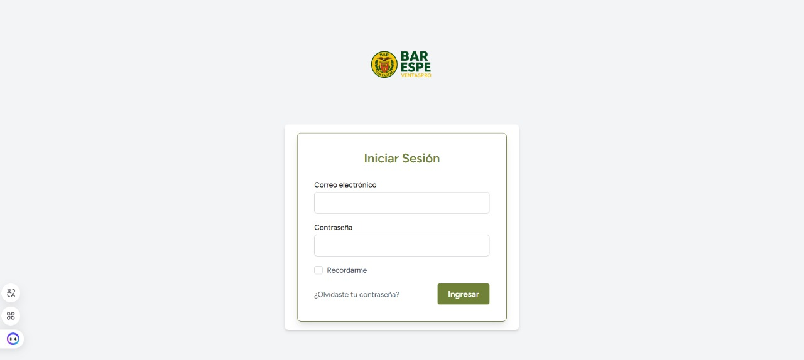
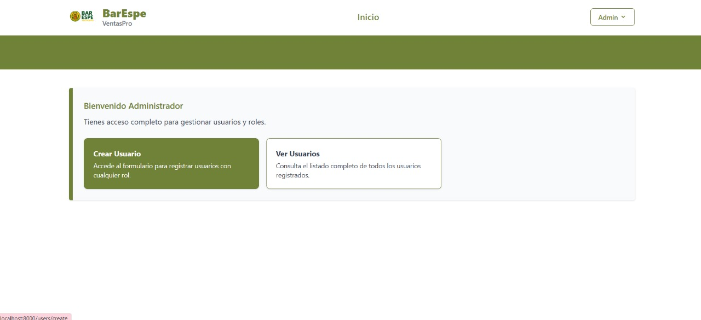
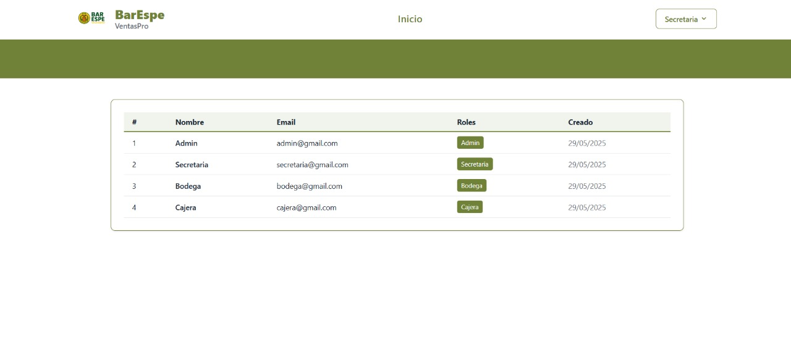
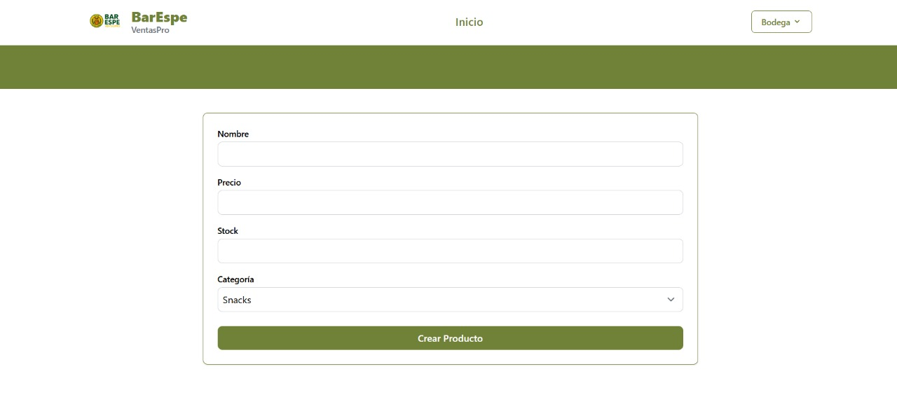

<p align="center">
  
</p>

<h1 align="center">BarEspe VentasPro</h1>

<p align="center">
  Sistema de gestión de ventas desarrollado en Laravel.
  <br>
  Control de productos, usuarios y roles con interfaz moderna y responsive.
</p>

---

## 🛠️ Tecnologías

- ⚙️ Laravel 10+
- 🌐 Blade y Tailwind CSS
- 🧩 Laravel Breeze (autenticación)
- 👥 Spatie Laravel Permissions
- 🧪 PHPUnit / Laravel Artisan Test
- 🧾 MySQL / MariaDB

---

## 🚀 Características Principales

- 👤 Gestión de usuarios con roles:
  - `Admin` – Acceso total al sistema.
  - `Secretaria` – Manejo parcial de usuarios.
  - `Bodega` – Gestión de productos y categorías.
  - `Cajera` – Registro de ventas.

- 📦 Control de inventario
- 💳 Registro y listado de ventas
- 📊 Panel de control personalizado por rol
- 🌙 Tema claro con acento en verde oliva (#708238)

---

## 📸 Aplicación

| Inicio | Login | Dashboard |
|--------|-------|-----------|
|  |  |  |

| Roles de Usuario | Inventario |
|------------------|------------|
|  | |
---

## ⚙️ Instalación Rápida

```bash
# Clona el repositorio
git clone https://github.com/NahirCarrera/VentasPro.git
cd ventaspro

# Instala dependencias
composer install
npm install && npm run dev

# Configura el entorno
cp .env.example .env
php artisan key:generate

# Configura la base de datos en .env
# Luego:
php artisan migrate --seed

# Inicia el servidor
php artisan serve
